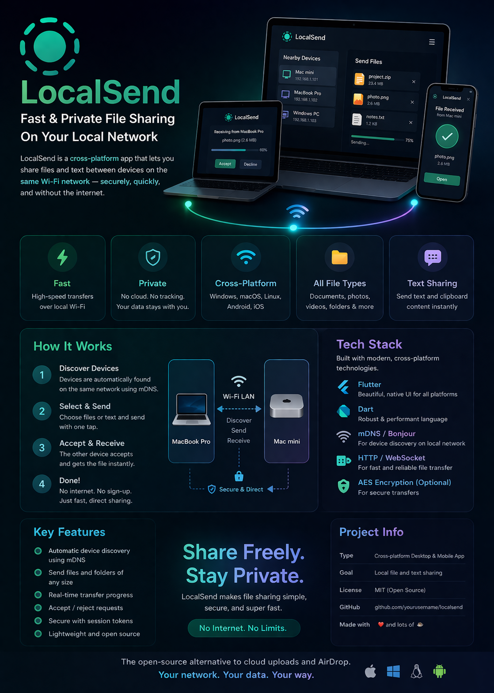

# Local Sender

Local Sender is a Flutter app for discovering nearby devices and managing file transfers over local network connections. It includes device discovery, file send/receive flows, permission handling, transfer history, and a clean GetX-based architecture.

## Features

- Discover nearby devices on the same network
- Send files to remote receivers
- Receive files from local senders
- Transfer history and progress tracking
- Permissions management for storage and location
- Responsive UI with loading and empty state handling

## Project Structure

- `lib/app` – app configuration, routing, and dependency injection
- `lib/core` – shared services, utilities, and constants
- `lib/domain` – entities, use cases, and repository abstractions
- `lib/data` – data sources, repositories, and models
- `lib/features` – feature modules for home, transfer, and settings

## Getting Started

1. Install Flutter and set up your environment
2. Run `flutter pub get`
3. Launch the app with `flutter run`

## Screenshot

## Notes

- The app uses `get` for state management and routing
- The UI currently includes device discovery, transfer lists, and settings
- Add assets in `assets/demo/LocalSend.png` and update `pubspec.yaml` if the image is needed at runtime
